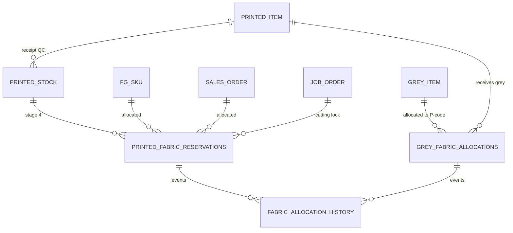
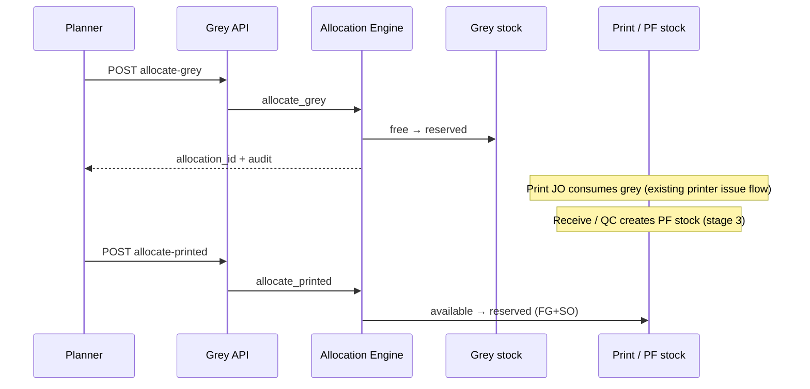
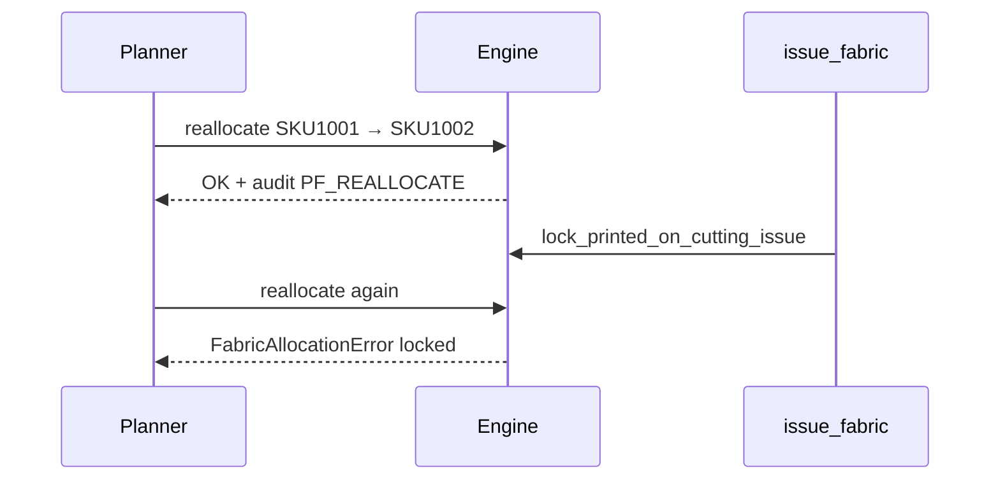
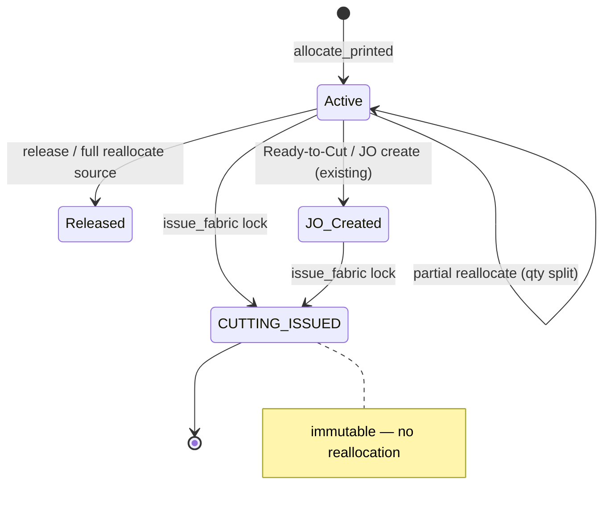

# Grey Fabric Planning, Allocation & Reallocation

## 1. Functional design

### Core principle
Grey fabric is planned and printed against **Printed Fabric (P-Code / SFG)**, never directly against FG SKU. FG SKU status is determined by the **current** printed-fabric allocation until **Cutting Issue**, after which allocation is **locked**.

### Hierarchy (expandable MRP tree)
```
Grey Fabric → Printed Fabric (P-Code) → FG SKU → Sales Order
```

### Stages (never merge)
| Stage | Event | Entity |
|-------|--------|--------|
| 1 | Grey allocation | `grey_fabric_allocations` |
| 2 | Printing JO | printer issue / JWO (+ display of stage-1) |
| 3 | Printed fabric receipt | `printed_fabric_*` / QC stock |
| 4 | Printed fabric allocation | `printed_fabric_reservations` |
| 5 | Cutting issue (lock) | reservation `status/stage = CUTTING_ISSUED` |

### Allocation vs reallocation
- **Grey allocate**: free → reserved grey meters for a P-code (optional SO/FG *intent*).
- **Printed allocate**: checked PF free → reserved to FG+SO.
- **Printed reallocate**: move reserved PF FG+SO → other FG+SO without changing grey purchase, print JO, consumption, or receipt qty.
- **Lock**: `issue_fabric` on production JO locks matching PF reservations; further reallocation raises `FabricAllocationError`.

### Reporting
`fg_status_report` and the planning tree leaf status use **current** `printed_fabric_reservations`, not original grey allocation intent.

**Production MRP breakdown** (Material Requirement screen) shows the same hierarchy for every material line:
`FG SKU | P-Code | Required Qty | Allocated Qty | Status`
Allocation remains **P-Code-centric** (grey allocate → P-Code); FG is retained so SKU-level dashboards can trace Grey ordered/allocated/issued through to Dispatch.

### Audit
Every allocate / reallocate / release / lock appends `fabric_allocation_history` (never deleted). Fields: timestamp, user, from/to SO+SKU, qty, reason, document_ref, statuses.

---

## 2. Database schema

### New tables (grey.db)
- **`grey_fabric_allocations`**: grey_code, printed_code, optional so/fg_sku, qty, stage, status, jwo_ref, audit cols
- **`fabric_allocation_history`**: append-only event log

### Extended
- **`printed_fabric_reservations`**: `stage`, `locked_at`, `locked_reason`, `jo_id`, `cutting_issued_qty`
- Existing stock ledgers: `fabric_checked_stock`, `printed_fabric_checked_stock`, `hard_reservations` (compat)

Migration: created in `grey_db.init_db()` (idempotent CREATE / ALTER).

---

## 3. ERD (logical)



---

## 4. API design (`/api/grey/planning/*`)

| Method | Path | Purpose |
|--------|------|---------|
| GET | `/tree` | MRP hierarchy tree |
| GET | `/grey-stock` | Free vs allocated grey |
| GET | `/grey-allocations` | Grey allocation lines |
| POST | `/allocate-grey` | Stage 1 |
| POST | `/release-grey/{id}` | Reverse stage 1 |
| POST | `/allocate-printed` | Stage 4 |
| POST | `/reallocate-printed` | Priority change pre-cut |
| POST | `/release-printed/{id}` | Release pre-cut |
| GET | `/printed-allocations` | List PF reservations |
| GET | `/history` | Audit trail |
| GET | `/printing-jo-status` | Grey ready for print JO |
| GET | `/fg-status-report` | Current PF-based FG status |

Errors: HTTP 400 + detail for business rules (over-allocate, post-cut reallocate).

---

## 5–9. Service / engines

Implementation: `backend/services/fabric_allocation_engine.py`

- **Inventory flow**: Grey free − alloc; PF available − reserve; reallocate keeps PF warehouse reserved total; cut issues deduct available and lock reservation.
- **Allocation engine**: `allocate_grey`, `allocate_printed`, validators on free qty.
- **Reallocation engine**: `reallocate_printed` + `_is_pf_locked`.
- **MRP**: `build_planning_tree` walks open SO × BOM (FG→SFG→GF when available).
- **Reporting**: `fg_status_report`, tree leaf colors.

---

## 10. UI

Grey Fabric page → tab **Planning & Allocation**:
- MRP Tree, Allocate, Reallocate, Printing JO, FG Status, Audit Trail  
Colors: green allocated, blue printed/locked, orange partial, grey pending, red shortage.

---

## 11–12. Tests & data

`tests/test_fabric_allocation_planning.py` — scenarios 1–14 (+ reconciliation, release lock).

Seed helpers: grey check stock + printed QC stock in-test.

---

## 13–14. Migration & deliverables map

| Deliverable | Location |
|-------------|----------|
| Schema | `backend/db/grey_db.py` `init_db` |
| Engine | `backend/services/fabric_allocation_engine.py` |
| API | `backend/routers/grey.py` `/planning/*` |
| Cutting lock | `production_db.issue_fabric` |
| UI | `frontend/src/pages/GreyFabric.tsx` planning tab |
| Tests | `tests/test_fabric_allocation_planning.py` |
| This doc | `docs/grey_fabric_planning_allocation.md` |

---

## 15. Sequence diagrams

### Allocate grey then print then receive then allocate PF



### Reallocate before cutting; fail after



---

## 16. State diagram (printed reservation)



---

## Business rules (summary)
- Cannot allocate more than free stock.
- Cannot reallocate / release PF after cutting issue.
- History never deleted; reverse via release / reallocate, not row delete.
- Multiple FG SKUs share one P-code; one P-code serves many SOs.
