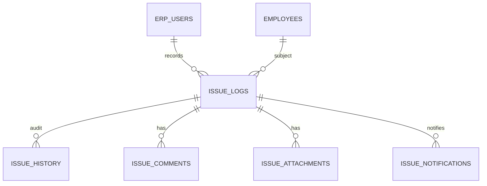

# HRM Issues Management Module

## Functional design

Every issue records **who it is about (Employee / subject user)**, **who caused it (Caused By)**, and **who recorded it (Recorded By)** — with Recorded By always the authenticated user and **immutable**.

### Status lifecycle
`Open` → `Hold` / `Resolve` / `Cancel` (legacy `Resolved` migrated to `Resolve`)

### Voice input
Browser Web Speech API (continuous, pause/resume). Appends to Title/Description without overwriting unless empty. Failures are logged via `POST /issues/voice-log` and never block create.

### Permissions
| Role | Create | Edit | Status | View |
|------|--------|------|--------|------|
| Admin / Super Admin / Sir / legacy ERP | Yes | Yes | Yes | All (scope) |
| HOD | Yes | Team | Team | Department |
| Employee | Yes (scope) | No | No | Self |

---

## Schema (`hrm.db`)

**issue_logs** (+ `recorded_by_user_id`, `subject_user_id/name`, `caused_by_user_id/name`, `updated_at`, `designation`)

**issue_history** · **issue_comments** · **issue_attachments** · **issue_voice_transcriptions** · **issue_notifications**

Migrations: `hrm_db.init_db()` ALTER + status rename.

---

## ERD

---

## API (`/api/hrm`)

| Method | Path | Notes |
|--------|------|-------|
| GET | `/issues/users?q=` | Active ERP users search |
| GET | `/issues/meta` | Statuses/types |
| GET | `/issues` | Filters: employee, dept, status, dates, caused_by, recorded_by, designation, q |
| POST | `/issues` | Recorded By forced from auth |
| PATCH | `/issues/{id}` | Edit (not recorded_by/created/id) |
| PATCH | `/issues/{id}/status` | Lifecycle |
| PATCH | `/issues/{id}/resolve` | → Resolve |
| DELETE | `/issues/{id}` | Soft → Cancel (Admin) |
| GET/POST | `/issues/{id}/comments` | |
| GET/POST | `/issues/{id}/attachments` | Metadata |
| GET | `/issues/{id}/history` | Audit |
| POST | `/issues/voice-log` | Transcription audit |
| GET | `/issues/notifications` | In-app |

---

## UI

HRM → **Issues** tab: voice controls, searchable user pickers, read-only Recorded By, list columns per FR5 with hidden Recorded By when same as Employee, status badges, audit panel.

---

## Tests

`tests/test_hrm_issues_management.py` — create, forge protection, status, edit/audit, RBAC, search, users, voice, notifications, column flags.
